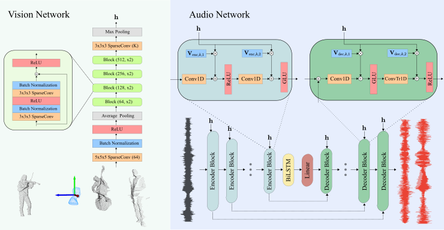

<div  align="center">

# Points2Sound

From mono to binaural audio using 3D point cloud scenes.
    
[paper](https://arxiv.org/abs/2104.12462) - [code](https://github.com/francesclluis/points2sound) - [audio samples](https://youtu.be/6wCMXJI7mvo)
    
</div>

## About

This respository contains the implementation of the paper "Points2Sound: From mono to binaural audio using 3D point cloud scenes".



## Installation
For installation instructions, please see [INSTALL.md](INSTALL.md).

## Dataset
1. Download 'cello', 'doublebass', 'guitar', 'saxophone' and 'violin' audios from [MUSIC dataset](https://github.com/roudimit/MUSIC_dataset) and [SOLOS dataset](https://github.com/JuanFMontesinos/Solos).

2. Use script ```generate_binaural_data.m``` to generate binaural versions from individual mono recordings. Tested under Matlab 2018.

3. Download [The 3D-video Point Cloud Musicians Dataset](https://zenodo.org/record/4812952).

4. Create training/validation/test index files.

    a. Set the following directory structure:
    ```
    data
    ├── audio
    |   ├── cello
    │   |   ├── 0jSLgzeFmao_0.wav
    │   |   ├── 0jSLgzeFmao_45.wav
    │   |   ├── ...
    │   ├── doublebass
    │   |   ├── 1oXh85Qjkf8_0.wav
    │   |   ├── 1oXh85Qjkf8_45.wav
    │   |   ├── ...
    │   ├── ...
    |
    └── frames
    |   ├── cello
    │   |   ├── person_1
    │   |   |   ├── 00000.ply
    │   |   |   ├── ...
    │   |   ├── ...
    │   ├── doublebass
    │   |   ├── person_1
    │   |   |   ├── 00000.ply
    │   |   |   ├── ...
    │   |   ├── ...
    │   ├── ...
    ```

    b. Make training/validation/test index files by running:
    ```
    python scripts/create_index_files.py
    ```
    It will create index files ```train.csv```/```val.csv```/```test.csv``` with the following format:
    ```
    ./data/audio/cello/0jSLgzeFmao,./data/frames/cello/person_1,771
    ./data/audio/doublebass/1oXh85Qjkf8,./data/frames/doublebass/person_5,740
    ```
    For each row, it stores the information: ```AUDIO_PREFIX_PATH,FRAMES_PATH,NUMBER_FRAMES```


## Training

1. Use the following command to train Points2Sound.
```
./scripts/train_Points2Sound.sh
```
2. Use the following command to train Mono2Binaural.
```
./scripts/train_Mono2Binaural.sh
```

## Testing

Trained models weights are available at: https://drive.google.com/drive/folders/1hQN-CqLt_ygNVvIoFmBMWeg-61eJOflU?usp=sharing \
Locate ```resnet18_pretrained.pth``` inside ```./models/``` \
Locate ```Point2Sound``` folder inside ```./ckpt/``` \
Locate ```Mono2Binaural``` folder inside ```./ckpt/```\
Note that provided weights correspond to models trained using rgb-depth 3D scenes.

Download small test data from: https://drive.google.com/drive/folders/1xpN9-C1DqjExNn2te5tDf6ybvNqB_6_k?usp=sharing \
Locate testing sample data folders (i.e. Source_N_1, Source_N_2, Source_N_3) inside ```./small_test_data```


1. Use the following command to run Points2Sound predictions on ./small_test_data/Source_N_1
```
./scripts/test_Points2Sound.sh
```
2. Use the following command to run Mono2Binaural predictions on ./small_test_data/Source_N_1
```
./scripts/test_Mono2Binaural.sh
```

Change the ```--num_mix ``` parameter in ```./scripts/test_Points2Sound.sh``` and ```./scripts/test_Mono2Binaural.sh``` to run predictions on mixtures created by N sources

Change the ```--id ``` parameter to select the weights from another trained model in ```./ckpt```

Predicted binaural audios are saved in the same "small_test_data" folders.

## Evaluate

1. Use the following command to evaluate the predictions
```
python evaluate.py --num_mix 1
```

## Generate Binaural Versions

Script ```generate_binaural_data.m``` is used to generate binaural versions from individual mono recordings. Tested under Matlab 2018.

## Acknowlegements
We reuse code from 2.5D-Visual-Sound (https://github.com/facebookresearch/2.5D-Visual-Sound), Cone-of-Silence (https://github.com/vivjay30/Cone-of-Silence), Sound-of-Pixels (https://github.com/hangzhaomit/Sound-of-Pixels) and the MinkowskiEngine (https://github.com/NVIDIA/MinkowskiEngine)
